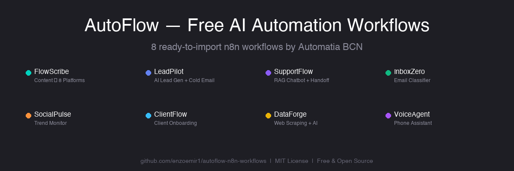
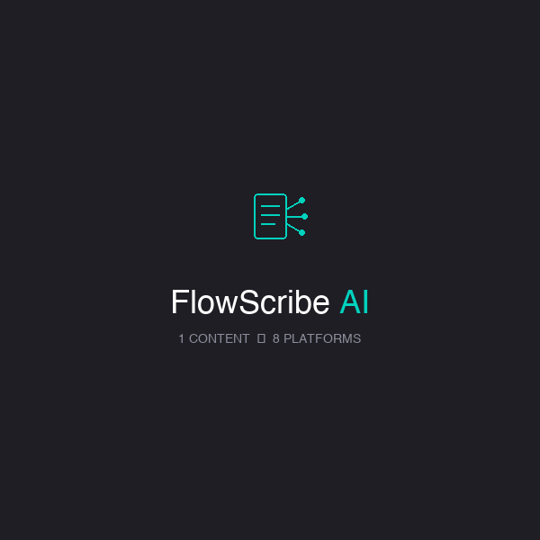
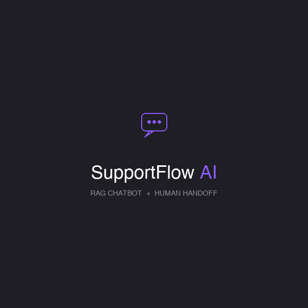
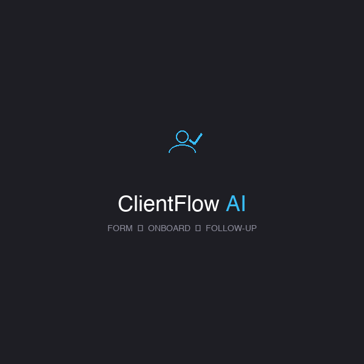

<p align="center">
  
</p>

<p align="center">
  
  
  
  
  
</p>

<p align="center">
  <strong>8 free, production-ready n8n workflow templates for AI automation.</strong>
  <br />
  Content repurposing · Lead generation · Email classifier · RAG chatbot · Social monitor · Client onboarding · Web scraping · Voice assistant
  <br /><br />
  Built by <a href="https://automatiabcn.com">Automatia BCN</a> · Barcelona
</p>

---

## What's Included

<table>
<tr>
<td align="center" width="25%">
<br />
<strong>FlowScribe Lite</strong><br />
<sub>1 content → 4 platforms</sub>
</td>
<td align="center" width="25%">
<br />
<strong>LeadPilot Lite</strong><br />
<sub>AI cold email writer</sub>
</td>
<td align="center" width="25%">
<br />
<strong>SupportFlow Lite</strong><br />
<sub>AI chatbot (no RAG)</sub>
</td>
<td align="center" width="25%">
<br />
<strong>InboxZero Lite</strong><br />
<sub>Email classifier</sub>
</td>
</tr>
<tr>
<td align="center">
<br />
<strong>SocialPulse Lite</strong><br />
<sub>Reddit trend monitor</sub>
</td>
<td align="center">
<br />
<strong>ClientFlow Lite</strong><br />
<sub>Client onboarding</sub>
</td>
<td align="center">
<br />
<strong>DataForge Lite</strong><br />
<sub>URL data extractor</sub>
</td>
<td align="center">
<br />
<strong>VoiceAgent Lite</strong><br />
<sub>Call logger</sub>
</td>
</tr>
</table>

---

## Quick Start

```bash
# 1. Clone this repo
git clone https://github.com/enzoemir1/autoflow-n8n-workflows.git

# 2. Import any JSON into n8n
#    Workflows → Import from File → select a JSON from workflows/

# 3. Connect your credentials
#    Most need: OpenAI API key + Google Sheets

# 4. Activate and test
```

---

## Workflow Details

### FlowScribe Lite — Content Repurposing
Send a blog post via webhook → AI generates optimized content for **Twitter thread + LinkedIn post + Instagram caption + Facebook post** in parallel → saves to Google Sheets.

**Cost:** ~$0.01/run | **Input:** Blog post via webhook | **Output:** 4 platform-specific posts

### LeadPilot Lite — Cold Email Writer
POST a list of leads → AI writes a **personalized cold email + follow-up** for each → saves to Sheets.

**Cost:** ~$0.005/lead | **Input:** Lead list (name, email, title, company) | **Output:** Custom email per lead

### SupportFlow Lite — AI Chatbot
Simple chatbot that answers customer questions using your company info (set via environment variable). No vector database needed.

**Cost:** ~$0.002/message | **Setup:** 2 minutes

### InboxZero Lite — Email Classifier
Polls Gmail every 5 minutes, classifies each new email into: **urgent, important, informational, or spam**. Logs to Sheets.

**Cost:** ~$0.002/email | **Trigger:** Automatic (Gmail poll)

### SocialPulse Lite — Reddit Monitor
Fetches hot posts from a subreddit daily, ranks by engagement, **AI identifies trends + suggests content ideas**.

**Cost:** ~$0.03/scan | **Data source:** Reddit (free, no API key needed)

### ClientFlow Lite — Client Onboarding
Webhook receives client form data → **sends welcome email** via Gmail → logs to Google Sheets pipeline.

**Cost:** Free (no AI) | **Trigger:** Any form (Typeform, Google Forms, Tally)

### DataForge Lite — URL Data Extractor
POST a URL + fields to extract → fetches page → **AI extracts structured data** → returns JSON.

**Cost:** ~$0.003/page | **Input:** Any URL | **Output:** Structured JSON

### VoiceAgent Lite — Call Logger
Receives call data from **Vapi.ai or Bland.ai** webhook → logs caller, duration, transcript to Sheets.

**Cost:** Free | **Trigger:** Vapi/Bland webhook

---

## Requirements

| Requirement | Details |
|------------|---------|
| **n8n** | Cloud or self-hosted · [n8n.io](https://n8n.io) |
| **OpenAI API** | gpt-4o-mini · ~$0.002-0.01/call · [Get key](https://platform.openai.com/api-keys) |
| **Google Sheets** | Free Google account |
| **Gmail** | InboxZero + ClientFlow only |

---

## Full Versions

These are Lite (free) versions. Full versions add more platforms, A/B testing, advanced analytics, and complete documentation.

| Product | Lite (Free) | Full Version |
|---------|------------|-------------|
| FlowScribe | 4 platforms | 8 platforms + A/B testing + posting schedule |
| LeadPilot | Manual leads | Apollo.io search + AI scoring + auto-send |
| SupportFlow | Simple chatbot | RAG (Pinecone) + human handoff + chat widget |
| InboxZero | Classify + log | Auto-actions + draft replies + daily digest |
| SocialPulse | Reddit only | Reddit + HN + Dev.to + weekly reports |
| ClientFlow | Email + log | Stripe invoice + Calendar + 7-day follow-up |
| DataForge | Single URL | Batch scraping + change tracking + reports |
| VoiceAgent | Call logger | AI analysis + Calendar booking + Slack alerts |

**Full collection:** [automatiabcn.gumroad.com](https://automatiabcn.gumroad.com)

---

## Documentation

Each workflow has a detailed guide in the `docs/` folder:

| Workflow | Guide |
|----------|-------|
| FlowScribe Lite | [docs/flowscribe-lite.md](docs/flowscribe-lite.md) |
| LeadPilot Lite | [docs/leadpilot-lite.md](docs/leadpilot-lite.md) |
| SupportFlow Lite | [docs/supportflow-lite.md](docs/supportflow-lite.md) |
| InboxZero Lite | [docs/inboxzero-lite.md](docs/inboxzero-lite.md) |
| SocialPulse Lite | [docs/socialpulse-lite.md](docs/socialpulse-lite.md) |
| ClientFlow Lite | [docs/clientflow-lite.md](docs/clientflow-lite.md) |
| DataForge Lite | [docs/dataforge-lite.md](docs/dataforge-lite.md) |
| VoiceAgent Lite | [docs/voiceagent-lite.md](docs/voiceagent-lite.md) |

Each guide includes: setup instructions, input parameters, cost estimates, and a comparison with the full version.

---

## Example Outputs

See what each workflow produces in the `examples/` folder:

- [flowscribe-output.json](examples/flowscribe-output.json) — Blog post repurposed into 4 platform posts
- [leadpilot-output.json](examples/leadpilot-output.json) — AI-generated cold email + follow-up
- [inboxzero-output.json](examples/inboxzero-output.json) — Classified emails with AI reasoning
- [clientflow-output.json](examples/clientflow-output.json) — Complete onboarding flow output

---

## Related Projects

| Repo | Description |
|------|-------------|
| **[n8n-telegram-approval](https://github.com/enzoemir1/n8n-telegram-approval)** | Add human-in-the-loop approval to any n8n workflow via Telegram. Works great with FlowScribe for content review before publishing. |
| **[n8n-prompt-library](https://github.com/enzoemir1/n8n-prompt-library)** | 20 production-ready AI prompts for n8n workflows — content generation, data processing, email, classification, support, SEO. |
| **[n8n-cost-calculator](https://github.com/enzoemir1/n8n-cost-calculator)** | Estimate AI workflow costs before you build — compare 10 models, use presets, [live demo](https://enzoemir1.github.io/n8n-cost-calculator/). |
| **[free-ai-prompts](https://github.com/enzoemir1/free-ai-prompts)** | 90 free AI prompts across 9 categories — use them in the OpenAI nodes of these workflows. |
| **[cacheflow-ai](https://github.com/enzoemir1/cacheflow-ai)** | Reduce AI API costs by 60-85% with smart caching — drop-in proxy for any OpenAI-compatible workflow. |

---

## Contributing

Contributions are welcome! See [CONTRIBUTING.md](CONTRIBUTING.md) for guidelines on submitting workflows, reporting bugs, and suggesting features.

---

## About

Built by **Automatia BCN** — a Barcelona-based AI automation studio.

- **Website:** [automatiabcn.com](https://automatiabcn.com)
- **Products:** [automatiabcn.gumroad.com](https://automatiabcn.gumroad.com)
- **Twitter/X:** [@automatiabcn](https://x.com/automatiabcn)

---

## License

MIT License — free for personal and commercial use.

---

**If these workflows save you time, a ⭐ would mean a lot!**
